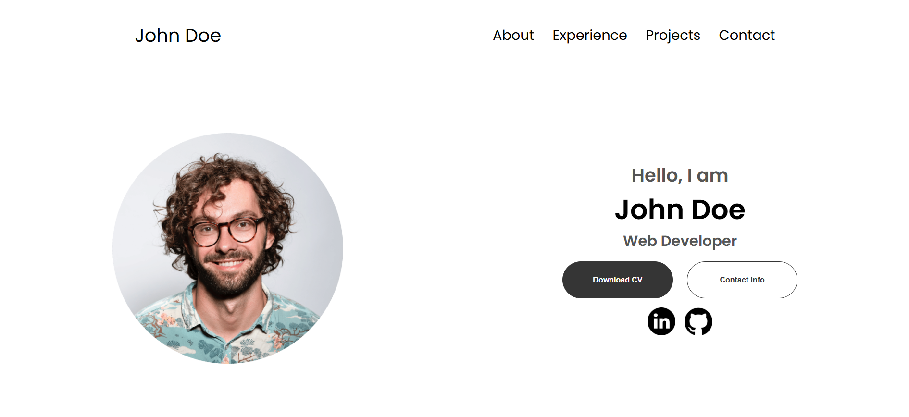
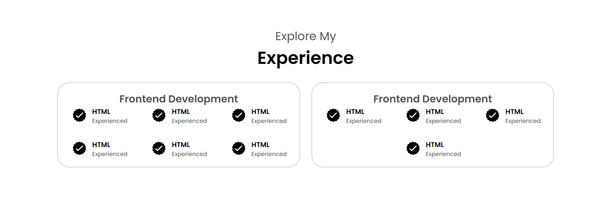
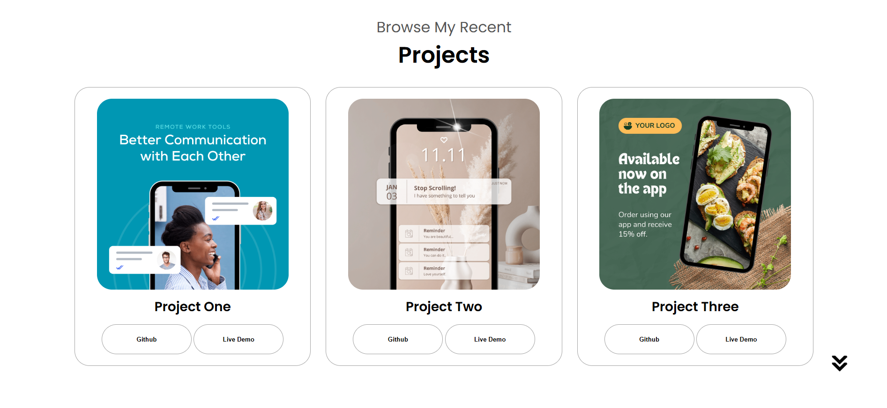
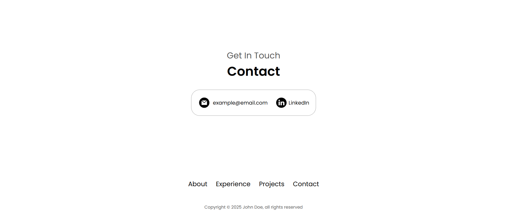

# Minimalist Portfolio

This project is a minimalist portfolio for a developer, created as a learning exercise to understand the basics of HTML and CSS. The portfolio showcases a clean design, featuring sections for About, Experience, Projects, and Contact.

## Features

- **Navigation**: Includes both desktop and mobile-friendly hamburger navigation.
- **Sections**:
  - **Profile**: Displays a profile picture and introduction.
  - **About**: Highlights experience and education.
  - **Experience**: Lists skills and expertise.
  - **Projects**: Showcases recent projects with images and links.
  - **Contact**: Provides contact information and social media links.

## Screenshots

Here are some screenshots of the project:

### Profile Section

### About Me Section

### Experience Section

### Projects Section

### Contact Section

## How to Use

1. Clone the repository or download the files.
2. Open `index.html` in your browser to view the portfolio.

## Technologies Used

- **HTML**: For structuring the content.
- **CSS**: For styling and layout.
- **JavaScript**: For interactive elements like the hamburger menu.

## Purpose

This project was built to practice and learn the fundamentals of web development, focusing on HTML and CSS. It serves as a simple yet functional portfolio template for developers.

## License

This project is open-source and available for personal or educational use.
