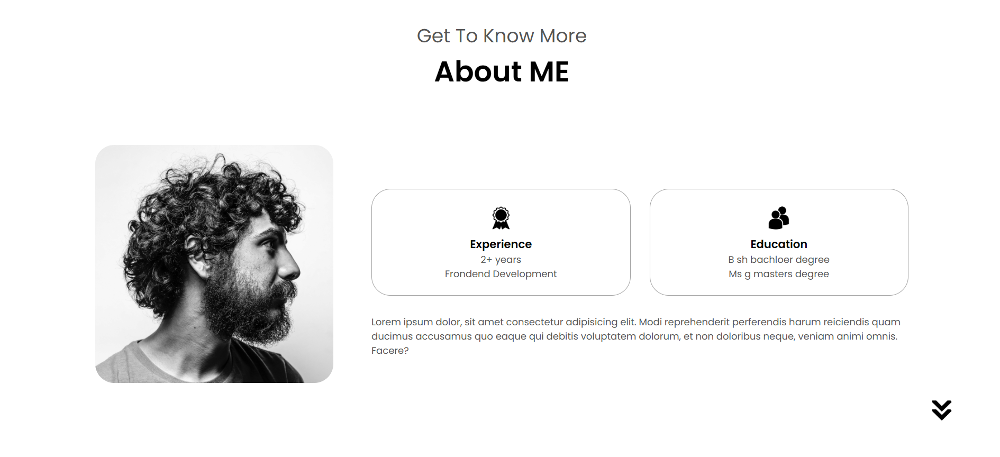

# Minimalist Portfolio

This project is a minimalist portfolio for a developer, created as a learning exercise to understand the basics of HTML and CSS.
 *This project was built by following a youtube tutorial. You can find the full video here:*
📺 [Responsive Portfolio Website From Scratch](https://www.youtube.com/watch?v=ldwlOzRvYOU)

The portfolio showcases a clean design, featuring sections for About, Experience, Projects, and Contact.

## Features

* **Navigation**: Includes both desktop and mobile-friendly hamburger navigation.
* **Sections**:

  * **Profile**: Displays a profile picture and introduction.
  * **About**: Highlights experience and education.
  * **Experience**: Lists skills and expertise.
  * **Projects**: Showcases recent projects with images and links.
  * **Contact**: Provides contact information and social media links.

## Screenshots

Here are some screenshots of the project:

### Profile Section

### About Me Section

### Experience Section

### Projects Section

### Contact Section

## Technologies Used

* **HTML**: For structuring the content.
* **CSS**: For styling and layout.
* **JavaScript**: For interactive elements like the hamburger menu.

## License

This project is open-source and available for personal or educational use.

